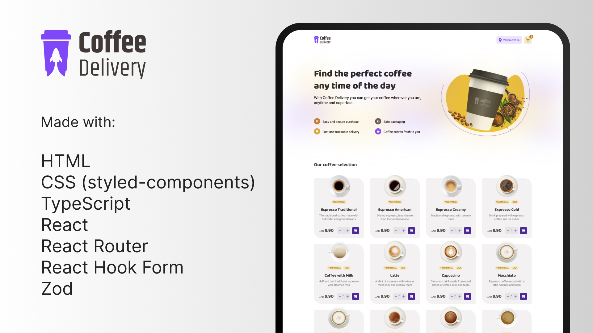

<h1 align="center"> Coffee Delivery </h1>

A web catalog of coffees that resembles what an e-commerce flow would look like.

Check it out live <a href="https://coffee-delivery-gray-nu.vercel.app">here</a>!

  <a href="#technologies">Technologies</a>&nbsp;&nbsp;&nbsp;|&nbsp;&nbsp;&nbsp;
  <a href="#project">Project</a>&nbsp;&nbsp;&nbsp;|&nbsp;&nbsp;&nbsp;
  <a href="#learnings">Learnings</a>&nbsp;&nbsp;&nbsp;

  

## Technologies

- HTML
- CSS (styled-components)
- TypeScript
- React
- React Router
- React Hook Form
- Zod

## Project

The goal of this project was to make a skeleton of an e-commerce experience with cart and checkout flows. Even though it is coffee themed at the moment, it should be fairly straightforward to adapt it to other business types too if they follow the same "catalog of items" style.

Since this was done purely for learning purposes, there are a few areas that were left on the side since they were not necessarily the focus area of the project (more on that on the next section). It was a fun project nonetheless though! Hopefully it can serve as a future reference for myself in the future.

## Learnings

The biggest learning for me on this project was around using TypeScript in conjunction with styled-components since it can be sometimes challenging to type component properties that have references with the global theme.

Also, even though it was not used extensively, it was also new to me to connect react-hook-form with zod by using the `@hookform/resolvers/zod` package and having the form types infered from the validation schema.

There are still quite a bit that can be done to make the project better (not an extensive list):

- Make the mobile styles better with consistent layout reuse amongst pages
- Add the font styles to the theme so that they can be easily swaped / changed
- Add empty styles for when there's nothing in the cart (that's why I have a coffee pre-added in the cart in the initialization of the state)
- Get the users' location to dynamically update the header
- Refactor the context to use a reducer + actions instead
